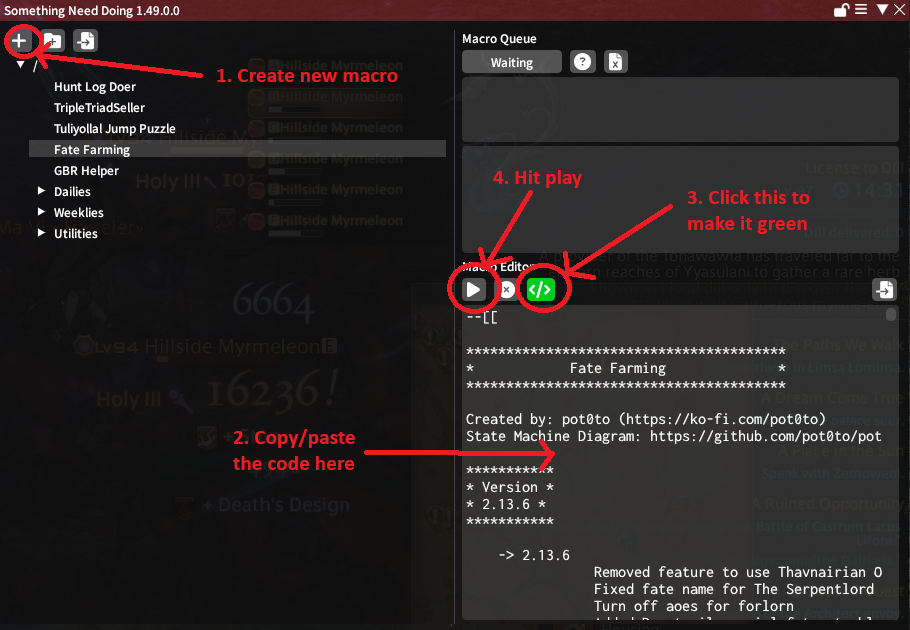
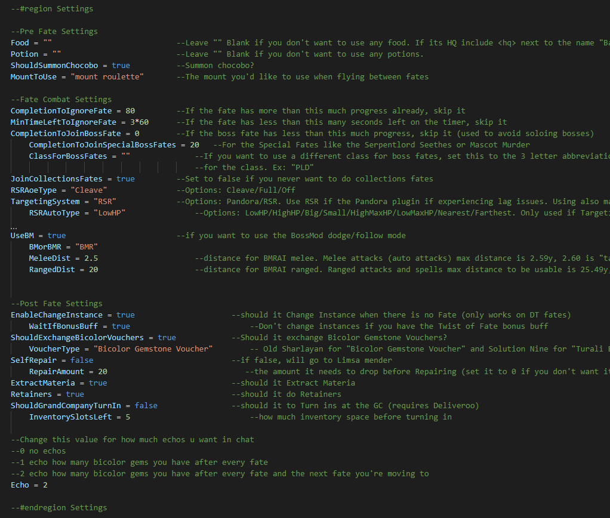
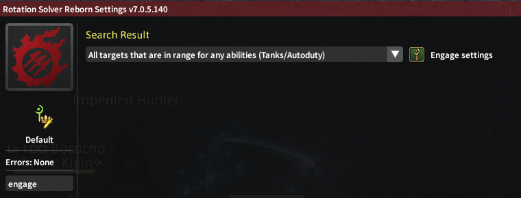
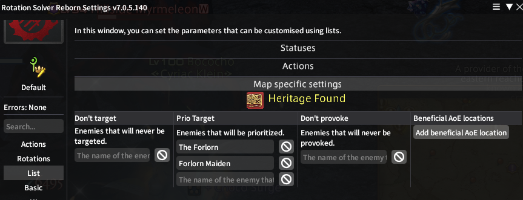
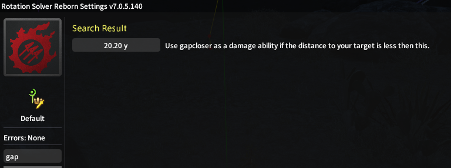

# Fate Farming
Fate farming script with the following features:
- Can purchase Bicolor Gemstone Vouchers (both old and new) when your gemstones are almost capped
- Priority system for Fate selection:  most progress > is bonus fate > least time left > distance
- Can prioritize Forlorns when they show up during Fate
- Can do all fates, including NPC collection fates
- Revives upon death and gets back to fate farming
- Attempts to change instances when there are no fates left in the zone
- Can process your retainers and Grand Company turn ins, then get back to fate farming
- Autobuys gysahl greens and grade 8 dark matter when you run out

## New to Something Need Doing (SND)

## Installing Dependency Plugins
### Required Plugins
| Plugin Name | Purpose | Repo |
|-------------|---------|------|
| Something Need Doing [Expanded Edition] | main plugin that runs the code | https://puni.sh/api/repository/croizat |
| VNavmesh | pathing and moving | https://puni.sh/api/repository/veyn |
| RotationSolver Reborn | targeting and attacking enemies | https://raw.githubusercontent.com/FFXIV-CombatReborn/CombatRebornRepo/main/pluginmaster.json |
| TextAdvance | interacting with Fate NPCs | comes with Dalamud |
| Teleporter | teleporting to aetherytes | comes with Dalamud |
| Lifestream | changing instances | https://raw.githubusercontent.com/NightmareXIV/MyDalamudPlugins/main/pluginmaster.json |

### Optional Plugins
| Plugin Name | Purpose | Repo |
|-------------|---------|------|
| BossModReborn | AI for dodging mechanics | https://raw.githubusercontent.com/FFXIV-CombatReborn/CombatRebornRepo/main/pluginmaster.json |
| ChatCoordinates | puts a flag on your map so you can see where you're going next | comes with Dalamud |
| AutoRetainer | handles retainers when they're ready, then gets back to Fate farming | https://love.puni.sh/ment.json |
| Deliveroo | turns in gear to your Grand Company when your retainers come back with too much and clog your inventory | https://plugins.carvel.li/ |

## Settings
### Script Settings
The script contains several settings you can mess around with to minmax gem income. This section is constantly changing, so check back whenever you update!

### RSR Settings
| | |
|--|--|
|  | Select "All Targets that are in range for any abilities (Tanks/Autoduty)" regardless of whether you're a tank |
|  | Add "Forlorn Maiden" and "The Forlorn" to Prio Targets |
|  | Recommended for melees: gapcloser distance = 20y |

## FAQ
### What's the best zone to farm fates?
Depends on your world and how many people are in each zone. More people in a zone means the fate mobs have more health. But also more people in a zone means more people doing the fate, so fates go faster. Popular map options are:
- Heritage Found: Low enough level that you can kill things fast, high enough level that you don't need to sync
- Kozama'uka: Good aetheryte coverage and no giant wall like Heritage Found
- Shaaloani: If you're ok with babysitting and are interested in the Special Fate (The SerpentLord Seethes for the capybara mount) or S ranks, though both will require manual intervention. Because of the Special Fate and S Ranks, this zone also tends to have a lot of people which can be good or bad depending on whether those people are doing fates with you or just AFK.
### What's the best class to use?
Depends on what you have, but popular options are:
- Whatever you have BiS for
- WAR has good survivability and gap close. Great for soloing because you can pull everything
- WHM holy spam stuns enemies. If you can survive the initial hits before holy goes off, it may complete fates faster than WAR
- VPR lots of damage, but survivability may be an issue. Set your chocobo to healer stance
- PCT also lots of damage, but fate bot may frequently move you out of landscape motif lines
### Why is my game lagging? Especially during boss fates?
Do you have Pandora installed? Try turning it off completely.

## Discord
https://discord.gg/punishxiv > ffxiv-snd (channel) > pot0to's fate script (thread)